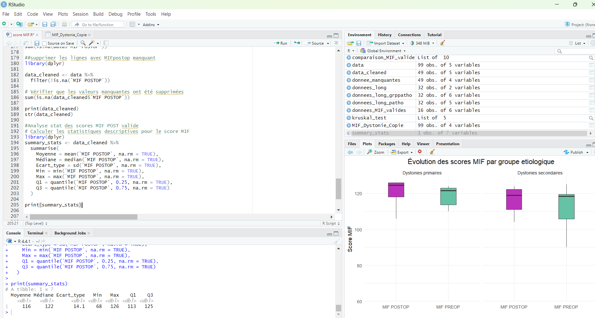

# MAM2ADMM-Series00-Git-NihadHam

This repository is used to learn the basics of Git and GitHub.

## Introduction

This repository is dedicated to learning the fundamentals of Git and GitHub through practical application. 
While my current experience is limited, I’m looking forward to learning more about Git and GitHub as I build experience with commits, branches, pull requests, and collaboration. 
My goal is to deepen my understanding and apply these version control practices effectively in future projects.

## A pretty image
Here is a beautiful picture that caught my attention.

## My Motivation to Learn Python, R, and Git :

I aim to master Python to transform my data ideas into reality.  
R fascinates me because it turns statistics and visualization into striking stories.  
Git helps me stay organized and collaborate efficiently.  
By learning these tools, I’ll become a more versatile and confident professional.  
I’m eager to experiment, embrace mistakes, and grow along the journey.

## 3.7 Add a local image to the readme file:
# My local image
Here is a screenshot of my latest R project code.

